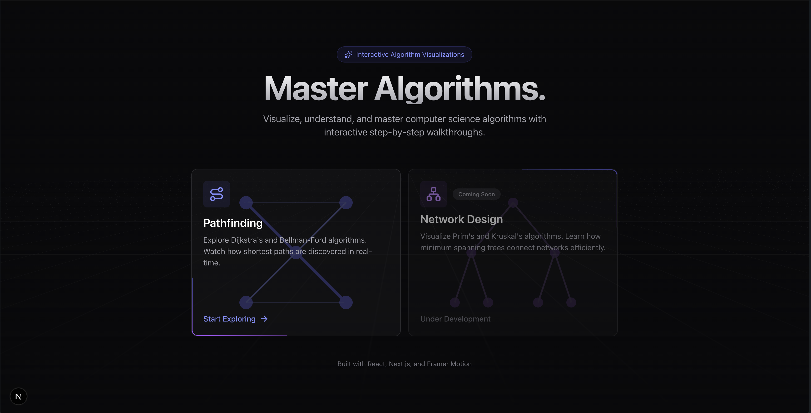
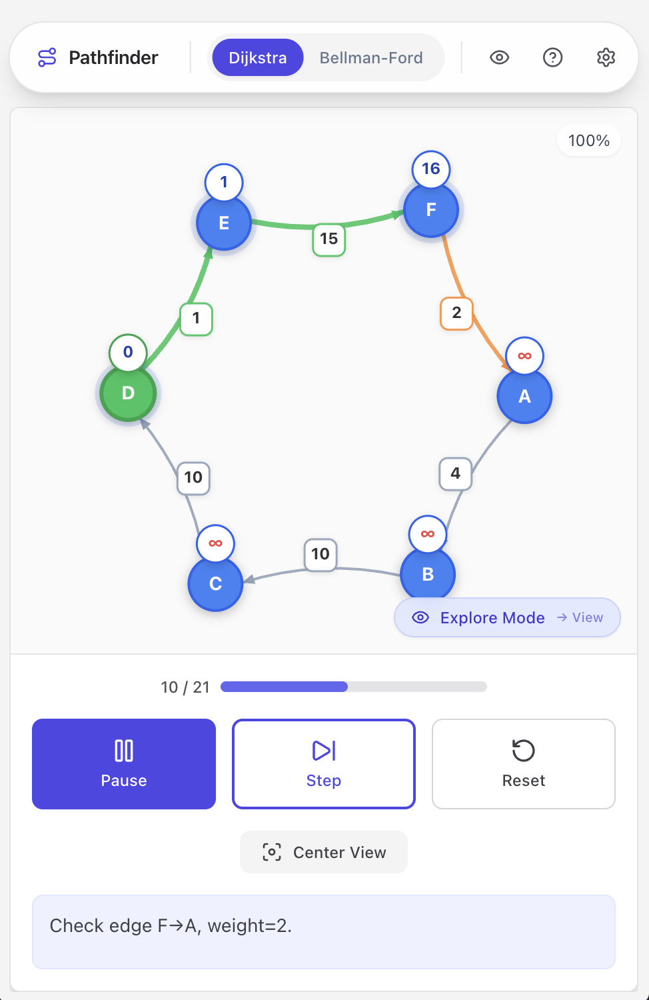

# Shortest Path Algorithm Visualizer

An interactive, educational web application for visualizing and understanding shortest path algorithms through step-by-step visual demonstrations. Built to make graph algorithms accessible to students, educators, and learners worldwide.



**Live Demo: [shortest-path-visualizer-pi.vercel.app](https://shortest-path-visualizer-pi.vercel.app)**

## Overview

The Shortest Path Algorithm Visualizer is a comprehensive educational tool designed to help students understand how graph algorithms work by providing real-time visual feedback and detailed explanations. Whether you're learning algorithms for the first time, preparing for exams, or teaching a computer science course, this tool provides an intuitive way to explore Dijkstra's algorithm and the Bellman-Ford algorithm.

The application is fully responsive and works seamlessly on desktop, tablet, and mobile devices, making it accessible to learners anywhere in the world.



## Motivation

While studying for Harvard's COMPSCI 1240 (Design and Analysis of Algorithms) Midterm, I found myself struggling to fully understand the nuances of shortest path algorithms by just reading textbooks or watching lecture videos. I searched for interactive tools that could help me visualize these algorithms step-by-step, but couldn't find any that matched what I needed.

So I decided to build one myself! This project was born out of a genuine need to better understand these fundamental algorithms through visualization, and I'm sharing it in the hope that it can help other students facing similar challenges.

## Educational Value

This visualizer addresses common challenges students face when learning graph algorithms:

- **Visual Learning**: See algorithms execute step-by-step rather than just reading pseudocode
- **Interactive Exploration**: Control the pace of execution and examine each step in detail
- **Real-time Feedback**: Understand how data structures update as algorithms progress
- **Multiple Learning Modes**: Switch between exploration (step-by-step) and view (final result) modes
- **Custom Graph Creation**: Build your own graphs to test understanding and explore edge cases

## Features

### Algorithm Implementations

**Dijkstra's Algorithm**
- Optimized for graphs with non-negative edge weights
- Visualizes priority queue (min heap) operations
- Shows distance updates and node visitation order
- Demonstrates greedy algorithm behavior

**Bellman-Ford Algorithm**
- Handles graphs with negative edge weights
- Detects and highlights negative cycles
- Shows iteration-by-iteration progress
- Illustrates dynamic programming approach

### Visualization Features

**Interactive Graph Display**
- Smooth Bezier curve edges for modern, readable graphs
- Color-coded nodes and edges indicating algorithm state
- Real-time distance labels on nodes
- Clear visual distinction between visited, candidate, and shortest path edges

**Algorithm State Panel**
- Current step counter with progress tracking
- Distance array visualization with highlighting
- Priority queue display (Dijkstra) or iteration progress (Bellman-Ford)
- Edge relaxation visualization with calculation breakdown
- Pseudocode with line-by-line highlighting

**Graph Creation Modes**

**Auto-Generate Mode**
- Configurable node count (4-15 nodes)
- Adjustable edge density
- Customizable weight ranges
- Guaranteed graph connectivity
- Optimized layouts for readability

**Manual Design Mode**
- Create custom graphs from scratch
- Add and remove nodes interactively
- Draw edges with custom weights
- Set source and target nodes
- Full control over graph structure
- Available on both desktop and mobile devices

### User Controls

**Playback Controls**
- Start/Pause: Control algorithm execution
- Step: Advance one step at a time for detailed study
- Reset: Clear execution and start fresh
- View Mode: Instantly see final shortest paths

**Visualization Modes**
- Explore Mode: Step through algorithm execution with full control
- View Mode: Display final results immediately for quick verification

**Mobile Optimizations**
- Touch-friendly interface with optimized controls
- Responsive graph rendering
- Full manual graph creation support
- Gesture-based pan and zoom
- Mobile-specific layout adjustments

## Technologies

- **React.js**: Component-based UI architecture
- **Tailwind CSS**: Utility-first styling with responsive design
- **JavaScript (ES6+)**: Modern JavaScript features
- **SVG Rendering**: Scalable vector graphics for crisp visualization
- **Local Storage**: Persistent user preferences

## Getting Started

### Live Demo

The easiest way to use the visualizer is through the live demo:
**[shortest-path-visualizer-pi.vercel.app](https://shortest-path-visualizer-pi.vercel.app)**

The application works in any modern web browser on desktop, tablet, or mobile devices. No installation required.

### Local Development

If you want to run the application locally or contribute to the project:

**Prerequisites**
- Node.js version 14.0 or higher
- npm version 6.0 or higher

**Installation Steps**

1. Clone the repository
   ```bash
   git clone https://github.com/yourusername/shortest-path-visualizer.git
   cd shortest-path-visualizer
   ```

2. Install dependencies
   ```bash
   npm install
   ```

3. Start the development server
   ```bash
   npm start
   ```

4. Open your browser and navigate to `http://localhost:3000`

## How to Use

### Basic Workflow

1. **Select an Algorithm**: Choose between Dijkstra's algorithm or Bellman-Ford from the top navigation
2. **Configure Graph Settings**: Click the settings icon to open the configuration panel
3. **Choose Graph Mode**:
   - **Auto-Generate**: Adjust parameters and generate random graphs
   - **Manual Design**: Create custom graphs using the floating toolbar (desktop) or drawer controls (mobile)
4. **Set Source Node**: Select a starting node for the algorithm
5. **Start Visualization**: Use the Start button to begin automatic execution, or Step to advance manually
6. **Observe Algorithm State**: Watch the left panel update with distances, queue states, and pseudocode highlighting
7. **Switch Modes**: Toggle between Explore and View modes using the button in the bottom-right corner

### Manual Graph Creation

**Desktop**
- Use the floating toolbar in the bottom-left corner
- Click "Node" to add nodes by clicking on the graph
- Click "Edge" to connect nodes (click source, then target)
- Use "Set Source" and "Set Target" to mark special nodes
- Press ESC to cancel any active operation

**Mobile**
- Open the settings drawer
- Switch to Manual Design mode
- Use the toolbar buttons to add nodes, edges, and configure your graph
- All manual creation features are fully supported on mobile devices

### Learning Tips

- Start with small graphs (4-6 nodes) to understand the basics
- Use Step mode to examine each operation carefully
- Compare how Dijkstra and Bellman-Ford handle the same graph
- Create graphs with negative edges to see Bellman-Ford's capabilities
- Try different edge densities to see how it affects algorithm behavior
- Use View Mode to verify your understanding of the final result

## Project Structure

```
src/
├── components/
│   └── ShortestPathVisualizer/
│       ├── ShortestPathVisualizer.js      # Main application component
│       ├── GraphRenderer.js               # SVG graph rendering
│       ├── AlgorithmVisualizer.js         # Algorithm state visualization
│       ├── algorithm-viz/                 # Sub-components for algorithm display
│       │   ├── CurrentStepCard.js
│       │   ├── DistanceTable.js
│       │   ├── MinHeapVisualization.js
│       │   ├── IterationProgress.js
│       │   ├── PseudocodeHighlighter.js
│       │   └── EdgeRelaxationCard.js
│       ├── GraphGeneration.js             # Graph creation logic
│       ├── ManualModeToolbar.js           # Manual graph creation toolbar
│       ├── WeightInputPopover.js           # Edge weight input interface
│       ├── MobileControls.js               # Mobile-specific controls
│       ├── MobileMetrics.js                # Mobile metrics display
│       ├── DijkstraSteps.js                # Dijkstra algorithm implementation
│       └── BellmanFordSteps.js             # Bellman-Ford algorithm implementation
├── constants/
│   └── graphConfig.js                     # Configuration constants
└── App.js                                 # Root component
```

## Use Cases

### For Students

- Visualize algorithm execution to understand how they work
- Test your understanding by creating custom graphs
- Prepare for exams with interactive practice
- Explore edge cases like negative cycles and disconnected graphs

### For Educators

- Demonstrate algorithms in lectures and presentations
- Assign graph creation exercises using manual mode
- Show real-time algorithm state changes
- Compare different algorithms side-by-side

### For Self-Learners

- Learn at your own pace with step-by-step execution
- Experiment with different graph configurations
- Understand the relationship between pseudocode and execution
- Build intuition for algorithm behavior

## Contributing

This project is built as an educational tool for the global learning community. Contributions that improve the educational experience, accessibility, or functionality are welcome.

**How to Contribute**

1. Fork the repository
2. Create a feature branch (`git checkout -b feature/your-feature-name`)
3. Make your changes with clear commit messages
4. Test your changes thoroughly
5. Push to your branch (`git push origin feature/your-feature-name`)
6. Open a Pull Request with a detailed description

**Contribution Ideas**

- Additional algorithms (A*, Floyd-Warshall, Johnson's algorithm)
- Enhanced visualization options
- Performance optimizations
- Accessibility improvements
- Internationalization support
- Additional educational content and tutorials
- Export/import graph functionality
- Algorithm comparison mode

## Browser Support

The application is tested and works on:
- Chrome (latest)
- Firefox (latest)
- Safari (latest)
- Edge (latest)
- Mobile browsers (iOS Safari, Chrome Mobile)

## Performance

The visualizer is optimized for performance:
- Memoized calculations to prevent unnecessary re-renders
- Efficient graph rendering with SVG
- Responsive design that adapts to screen size
- Smooth animations and transitions

## Accessibility

- Keyboard navigation support
- High contrast color schemes
- Clear visual indicators
- Responsive touch targets for mobile
- Screen reader friendly structure

## License

This project is open source and available under the [MIT License](LICENSE).

## Acknowledgments

This project was developed as part of coursework at Harvard University's Computer Science department. Special thanks to the professors and teaching fellows who provided guidance and inspiration.

The visualizer is inspired by the need for better educational tools in algorithm visualization and aims to serve students and educators worldwide.

## Support

For questions, bug reports, or feature requests, please open an issue on the GitHub repository.

---

Built with React and Tailwind CSS. Designed for education.
