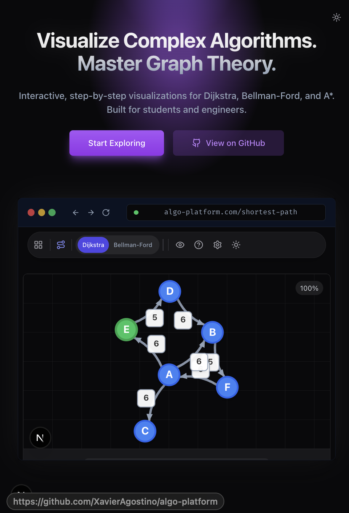

#  AlgoPlatform

[](https://opensource.org/licenses/MIT)
[](https://nextjs.org/)
[](https://react.dev/)
[](https://www.typescriptlang.org/)

A comprehensive, interactive platform for visualizing and understanding computer science algorithms through step-by-step visual demonstrations. Built to make complex algorithms accessible to students, educators, and learners worldwide.


**Live Demo: [algo-platform.vercel.app](https://algo-platform.vercel.app)**

## Table of Contents

- [Overview](#overview)
- [Features](#features)
- [Getting Started](#getting-started)
- [How to Use](#how-to-use)
- [Technologies](#technologies)
- [Project Structure](#project-structure)
- [Contributing](#contributing)
- [Roadmap](#roadmap)
- [License](#license)

## Overview

AlgoPlatform is an educational web application designed to help students understand fundamental computer science algorithms by providing real-time visual feedback, detailed explanations, and interactive exploration. What began as a tool for visualizing shortest path algorithms has evolved into a comprehensive platform supporting multiple algorithm categories.

The application is fully responsive and works seamlessly on desktop, tablet, and mobile devices, making algorithm visualization accessible to learners anywhere in the world.



## Motivation

While studying for Harvard's COMPSCI 1240 (Data Structures and Algorithms) Midterm, I found myself struggling to fully understand the nuances of shortest path algorithms by just reading textbooks or watching lecture videos. I searched for interactive tools that could help me visualize these algorithms step-by-step, but couldn't find any that matched what I needed.

So I decided to build one myself. This project was born out of a genuine need to better understand fundamental algorithms through visualization. As I continued developing the tool and exploring additional algorithm categories, the project naturally evolved into a platform—a unified hub where students can access multiple algorithm visualizers in one place.

## Platform Architecture

AlgoPlatform is built on Next.js with a modular architecture that allows for easy expansion. Each algorithm category is implemented as a separate tool within the platform, accessible through a centralized dashboard.

### Current Tools

**Pathfinding Algorithms**
- Dijkstra's Algorithm: Optimized for graphs with non-negative edge weights, visualizes priority queue operations and greedy behavior
- Bellman-Ford Algorithm: Handles graphs with negative edge weights, detects negative cycles, demonstrates dynamic programming approach

### Coming Soon

**Network Design Algorithms**
- Prim's Algorithm: Minimum spanning tree construction using a greedy approach
- Kruskal's Algorithm: Minimum spanning tree construction using union-find data structures

## Educational Value

This platform addresses common challenges students face when learning algorithms:

- **Visual Learning**: See algorithms execute step-by-step rather than just reading pseudocode
- **Interactive Exploration**: Control the pace of execution and examine each step in detail
- **Real-time Feedback**: Understand how data structures update as algorithms progress
- **Multiple Learning Modes**: Switch between exploration (step-by-step) and view (final result) modes
- **Custom Graph Creation**: Build your own graphs to test understanding and explore edge cases
- **Unified Platform**: Access multiple algorithm visualizers from a single interface

## Features

### Pathfinding Visualizer

**Algorithm Implementations**

Dijkstra's Algorithm
- Optimized for graphs with non-negative edge weights
- Visualizes priority queue (min heap) operations
- Shows distance updates and node visitation order
- Demonstrates greedy algorithm behavior

Bellman-Ford Algorithm
- Handles graphs with negative edge weights
- Detects and highlights negative cycles
- Shows iteration-by-iteration progress
- Illustrates dynamic programming approach

**Visualization Features**

Interactive Graph Display
- Smooth Bezier curve edges for modern, readable graphs
- Color-coded nodes and edges indicating algorithm state
- Real-time distance labels on nodes
- Clear visual distinction between visited, candidate, and shortest path edges

Algorithm State Panel
- Current step counter with progress tracking
- Distance array visualization with highlighting
- Priority queue display (Dijkstra) or iteration progress (Bellman-Ford)
- Edge relaxation visualization with calculation breakdown
- Pseudocode with line-by-line highlighting

**Graph Creation Modes**

Auto-Generate Mode
- Configurable node count (4-15 nodes)
- Adjustable edge density
- Customizable weight ranges
- Guaranteed graph connectivity
- Optimized layouts for readability

Manual Design Mode
- Create custom graphs from scratch
- Add and remove nodes interactively
- Draw edges with custom weights
- Set source and target nodes
- **Drag-and-drop nodes** to reposition them freely
- Real-time edge weight recalculation in spatial mode
- Full control over graph structure
- Available on both desktop and mobile devices

**User Controls**

Playback Controls
- Start/Pause: Control algorithm execution
- Step: Advance one step at a time for detailed study
- Reset: Clear execution and start fresh
- View Mode: Instantly see final shortest paths

Visualization Modes
- Explore Mode: Step through algorithm execution with full control
- View Mode: Display final results immediately for quick verification

**Mobile Optimizations**
- Touch-friendly interface with optimized controls
- Responsive graph rendering
- Full manual graph creation support
- Gesture-based pan and zoom
- Touch-based node dragging
- Mobile-specific layout adjustments

### Platform Features

**Centralized Dashboard**
- Clean, modern interface for selecting algorithm tools
- Visual previews of each tool
- Quick navigation between different visualizers
- Consistent design language across all tools

**Theme Support**
- Light and dark mode with system preference detection
- Smooth theme transitions
- Persistent theme preferences
- Optimized color schemes for both modes

**Responsive Design**
- Fully responsive across all screen sizes
- Mobile-first approach
- Optimized touch interactions
- Adaptive layouts for different devices

## Technologies

- **Next.js 15**: React framework with App Router for modern web development
- **React 19**: Component-based UI architecture with latest features
- **Tailwind CSS**: Utility-first styling with responsive design
- **Framer Motion**: Smooth animations and transitions
- **next-themes**: Theme management with system preference support
- **TypeScript/JavaScript**: Modern JavaScript features with type safety
- **SVG Rendering**: Scalable vector graphics for crisp visualization
- **Local Storage**: Persistent user preferences

## Getting Started

### Quick Start

The easiest way to use AlgoPlatform is through the live demo - no installation required:

**[Try it now: algo-platform.vercel.app](https://algo-platform.vercel.app)**

The application works in any modern web browser on desktop, tablet, or mobile devices.

### Prerequisites

- **Node.js** >= 18.0
- **npm** >= 9.0 (or **yarn** / **pnpm**)

### Installation

1. **Clone the repository**
   ```bash
   git clone https://github.com/XavierAgostino/algo-platform.git
   cd algo-platform
   ```

2. **Install dependencies**
   ```bash
   npm install
   # or
   yarn install
   # or
   pnpm install
   ```

3. **Start the development server**
   ```bash
   npm run dev
   # or
   yarn dev
   # or
   pnpm dev
   ```

4. **Open your browser**
   
   Navigate to [http://localhost:3000](http://localhost:3000)

### Build for Production

```bash
npm run build
npm start
```

### Troubleshooting

**Port already in use?**
```bash
# Use a different port
npm run dev -- -p 3001
```

**Dependencies installation issues?**
```bash
# Clear cache and reinstall
rm -rf node_modules package-lock.json
npm install
```

**Build errors?**
- Ensure you're using Node.js 18+ 
- Clear `.next` directory: `rm -rf .next`
- Rebuild: `npm run build`

## How to Use

### Platform Navigation

1. **Access the Dashboard**: The home page displays all available algorithm tools
2. **Select a Tool**: Click on any tool card to navigate to its visualizer
3. **Navigate Between Tools**: Use the home button in the navigation bar to return to the dashboard
4. **Switch Themes**: Use the theme toggle in the top-right corner or navigation bar

### Pathfinding Visualizer Workflow

1. **Select an Algorithm**: Choose between Dijkstra's algorithm or Bellman-Ford from the top navigation
2. **Configure Graph Settings**: Click the settings icon to open the configuration panel
3. **Choose Graph Mode**:
   - Auto-Generate: Adjust parameters and generate random graphs
   - Manual Design: Create custom graphs using the floating toolbar (desktop) or drawer controls (mobile)
4. **Set Source Node**: Select a starting node for the algorithm
5. **Start Visualization**: Use the Start button to begin automatic execution, or Step to advance manually
6. **Observe Algorithm State**: Watch the left panel update with distances, queue states, and pseudocode highlighting
7. **Switch Modes**: Toggle between Explore and View modes using the button in the bottom-right corner

### Manual Graph Creation

**Desktop**
- Use the floating toolbar in the bottom-left corner
- Click "Node" to add nodes by clicking on the graph
- Click "Edge" to connect nodes (click source, then target)
- Use "Set Source" and "Set Target" to mark special nodes
- **Drag nodes** to reposition them (edge weights auto-update in spatial mode)
- Press ESC to cancel any active operation

**Mobile**
- Open the settings drawer
- Switch to Manual Design mode
- Use the toolbar buttons to add nodes, edges, and configure your graph
- **Touch and drag nodes** to reposition them freely
- All manual creation features are fully supported on mobile devices

### Learning Tips

- Start with small graphs (4-6 nodes) to understand the basics
- Use Step mode to examine each operation carefully
- Compare how Dijkstra and Bellman-Ford handle the same graph
- Create graphs with negative edges to see Bellman-Ford's capabilities
- Try different edge densities to see how it affects algorithm behavior
- Use View Mode to verify your understanding of the final result
- Explore multiple tools to understand relationships between different algorithm categories

## Project Structure

```
app/
├── layout.js                    # Root layout with theme provider
├── page.js                      # Dashboard/home page
├── shortest-path/
│   └── page.js                  # Pathfinding visualizer route
└── globals.css                  # Global styles and theme variables

components/
├── ShortestPathVisualizer/      # Pathfinding tool components
│   ├── ShortestPathVisualizer.js
│   ├── GraphRenderer.js
│   ├── AlgorithmVisualizer.js
│   ├── algorithm-viz/          # Algorithm state visualization components
│   ├── GraphGeneration.js
│   ├── ManualModeToolbar.js
│   ├── MobileControls.js
│   ├── DijkstraSteps.js
│   └── BellmanFordSteps.js
├── ui/                          # Shared UI components
│   ├── floating-nav.jsx
│   ├── theme-toggle.jsx
│   ├── bento-grid.jsx
│   ├── border-beam.jsx
│   └── retro-grid.jsx
└── theme-provider.jsx           # Theme management

constants/
└── graphConfig.js              # Configuration constants

lib/
└── utils.js                    # Utility functions
```

## Use Cases

### For Students

- Visualize algorithm execution to understand how they work
- Test your understanding by creating custom graphs
- Prepare for exams with interactive practice
- Explore edge cases like negative cycles and disconnected graphs
- Compare different algorithms within the same category
- Access multiple algorithm tools from a single platform

### For Educators

- Demonstrate algorithms in lectures and presentations
- Assign graph creation exercises using manual mode
- Show real-time algorithm state changes
- Compare different algorithms side-by-side
- Use the platform as a teaching resource for multiple algorithm topics

### For Self-Learners

- Learn at your own pace with step-by-step execution
- Experiment with different graph configurations
- Understand the relationship between pseudocode and execution
- Build intuition for algorithm behavior
- Explore multiple algorithm categories in one place

## Roadmap

The platform is actively being developed with plans to add:

- Minimum Spanning Tree algorithms (Prim's, Kruskal's)
- Additional pathfinding algorithms (A*, Floyd-Warshall)
- Sorting algorithm visualizations
- Graph traversal algorithms (DFS, BFS)
- Dynamic programming visualizations
- Algorithm comparison modes
- Export/import graph functionality
- Enhanced educational content and tutorials

## Contributing

We welcome contributions! This project is built as an educational tool for the global learning community. Contributions that improve the educational experience, accessibility, or functionality are welcome.

Please read our [Contributing Guide](CONTRIBUTING.md) for details on our code of conduct and the process for submitting pull requests.

### Quick Contribution Guide

1. **Fork the repository**
2. **Create a feature branch**
   ```bash
   git checkout -b feature/your-feature-name
   ```
3. **Make your changes** with clear commit messages
4. **Test your changes** thoroughly
5. **Push to your branch**
   ```bash
   git push origin feature/your-feature-name
   ```
6. **Open a Pull Request** with a detailed description

### Contribution Ideas

- Additional algorithm implementations
- New algorithm categories and tools
- Enhanced visualization options
- Performance optimizations
- Accessibility improvements
- Internationalization support
- Additional educational content and tutorials
- Export/import graph functionality
- Algorithm comparison mode
- Mobile experience improvements

### Development Guidelines

- Follow existing code style and patterns
- Add comments for complex logic
- Update documentation for new features
- Test on multiple browsers and devices
- Ensure responsive design works on mobile

## Browser Support

The application is tested and works on:
- Chrome (latest)
- Firefox (latest)
- Safari (latest)
- Edge (latest)
- Mobile browsers (iOS Safari, Chrome Mobile)

## Performance

The platform is optimized for performance:
- Memoized calculations to prevent unnecessary re-renders
- Efficient graph rendering with SVG
- Responsive design that adapts to screen size
- Smooth animations and transitions
- Optimized bundle sizes with Next.js code splitting

## Accessibility

- Keyboard navigation support
- High contrast color schemes
- Clear visual indicators
- Responsive touch targets for mobile
- Screen reader friendly structure
- Theme support for reduced eye strain

## License

This project is open source and available under the [MIT License](LICENSE).

## Acknowledgments

This project was developed as part of coursework at Harvard University's Computer Science department. Special thanks to the professors and teaching fellows who provided guidance and inspiration.

The platform is inspired by the need for better educational tools in algorithm visualization and aims to serve students and educators worldwide.

## Support

- **Bug Reports**: [Open an issue](https://github.com/XavierAgostino/algo-platform/issues/new?template=bug_report.md)
- **Feature Requests**: [Open an issue](https://github.com/XavierAgostino/algo-platform/issues/new?template=feature_request.md)
- **Questions**: [Open a discussion](https://github.com/XavierAgostino/algo-platform/discussions)
- **Security Issues**: Please email security concerns privately (do not open a public issue)

## Changelog

See [CHANGELOG.md](CHANGELOG.md) for a list of changes and version history.

---

**Built with Next.js, React, and Tailwind CSS. Designed for education.**

**Star this repo if you find it helpful!**
